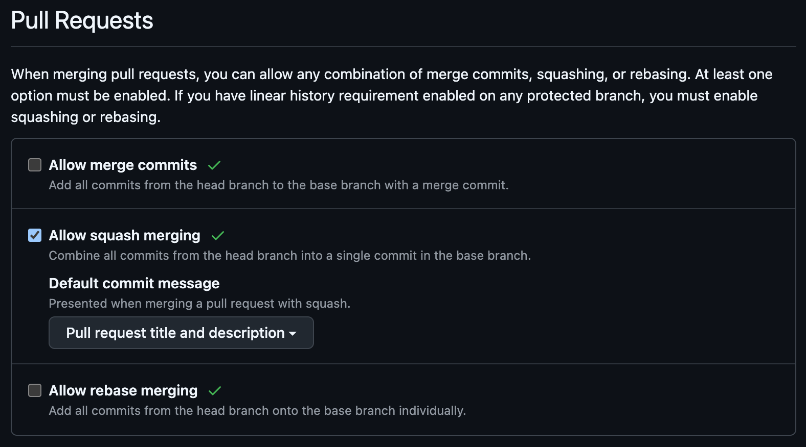

# Contributing

Conventions for opening pull requests and merging them. For environment
setup (clone → run), see [`specs/001-project-skeleton/quickstart.md`][qs].

[qs]: specs/001-project-skeleton/quickstart.md

## Pull requests

### Auto-closing issues

Every PR must list the issues it closes in its **description body** using
GitHub's closing keywords. The `pr-closes-check` workflow rejects PRs that
omit them.

**Why the body, not the commit message:** GitHub's `rebase and merge`
strategy discards commit-message closing keywords entirely — only keywords
in the PR description fire across every merge strategy. Putting them in the
body is the only choice that's correct under all three merge methods.

Accepted keywords (case-insensitive): `Close`, `Closes`, `Closed`,
`Fix`, `Fixes`, `Fixed`, `Resolve`, `Resolves`, `Resolved`. Each must be
followed by `#N`, `owner/repo#N`, or a full
`https://github.com/owner/repo/issues/N` URL.

Example PR body:

```
## Summary
- Implements T021 — pgxpool health-loop in backend/internal/db/pool.go

## Closes
Closes #23
Closes #24

## Test plan
- [ ] cd backend && go test ./...
- [ ] cd backend && go test -tags=integration ./test/integration/...
```

**Escape hatch.** PRs that legitimately close no issues (typo fixes, dep
bumps, docs-only) bypass the check by starting the PR body with
`[no-close]: <reason>` on its very first line. Use sparingly. The
`[no-close]` escape hatch does **not** exempt the trailers check below.

### Authorship trailers on squash commits

Constitution §B requires every commit on `main` to end with two trailers:

```
Authorship: <AI Generated | AI Assisted | Human>
AI-Tool: <Claude | Gemini | Cursor | Other>[, ...]    # or `none` if Human
```

The local `.husky/commit-msg` hook enforces this for every commit made
**on a branch**. But a squash-merge replaces those commits with a single
new commit composed by GitHub *on the server*, where the local hook does
not run. To keep the constitutional invariant on `main`, two things must
both be true:

1. **The trailers live in the PR body**, as the final non-empty lines
   (no content after them — otherwise `git interpret-trailers` won't
   recognize them as trailers). The PR template puts them in the right
   place; leave them at the bottom.
2. **The repo is configured so the PR body becomes the squash commit
   body.** This is a one-time repo setting — see [Merge methods](#merge-methods)
   below for the exact configuration (and a screenshot of the desired
   state).

The `pr-trailers-check` workflow rejects any PR whose body lacks valid
trailers or has content after them. The same regex used by
`.husky/commit-msg` is used by the workflow, so branch and squash commits
stay in lockstep.

**Granularity caveat.** Squash-merge collapses multiple branch commits
(each with its own per-commit trailer) into one. The squash commit bears
a *single* PR-level declaration. Pick the value that best summarizes the
overall PR — when in doubt, choose the most AI-leaning value that touched
any committed code (e.g., one "AI Generated" commit + four "Human"
commits → PR-level "AI Assisted", because human authored most but AI
authored some).

### Merge methods

Default: **Squash and merge**. The PR description becomes the commit body
(after the repo setting above), so both closing keywords and constitution
§B trailers always fire.

**Do not use rebase-merge for PRs that close issues.** Rebase-merge
replays the original commits onto `main` and ignores both closing
keywords and the PR body — issues won't auto-close, and the squashed
PR-level trailer declaration is bypassed.

To enforce in the GitHub UI (one-time, per repo):

- **Settings → General → Pull Requests** — match this configuration:

  

  Concretely:
  - Uncheck **Allow merge commits**.
  - Check **Allow squash merging** and set **Default commit message** to
    **"Pull request title and description"** (this is the `PR_TITLE` +
    `PR_BODY` API combo).
  - Uncheck **Allow rebase merging**.

- **Settings → Branches → branch protection rule for `main`** →
  Require status checks. Add both:
  - `check-closes-keyword` (from `.github/workflows/pr-closes-check.yml`)
  - `check-authorship-trailers` (from `.github/workflows/pr-trailers-check.yml`)

### Commit messages (on the branch)

Every commit body on a branch must end with the `Authorship:` and
`AI-Tool:` trailers required by constitution §B. The local
`.husky/commit-msg` hook enforces this.

```
feat(api): wire health probe to pgxpool

Authorship: AI Assisted
AI-Tool: Claude
```

The PR body inherits the *same* trailer format (see previous section) so
the squash commit on `main` is indistinguishable in trailer shape from a
direct branch commit.

### Branch naming

Per constitution §A and the local `.husky/pre-push` hook, branches must
match `^(0[0-9]{2}|1[0-9]{2}|2[0-9]{2})-[a-z0-9-]+$`:

- `001`–`099` — planned features (Specify lifecycle)
- `101`–`199` — ad-hoc work / bootstrap
- `201`–`299` — hotfixes

Direct pushes to `main` are blocked at `pre-push` and (once branch
protection is enabled) at the server.

## Speckit lifecycle

This repo uses the Speckit workflow (`/speckit-specify` → `/speckit-plan`
→ `/speckit-tasks` → `/speckit-taskstoissues` → `/speckit-implement`).
Each `/speckit-taskstoissues` run creates one GitHub issue per task
(`T###`) under the active feature label. PRs implementing those tasks
close them via the `Closes #N` lines described above — that is the
canonical handoff from the task list to the merged code.
